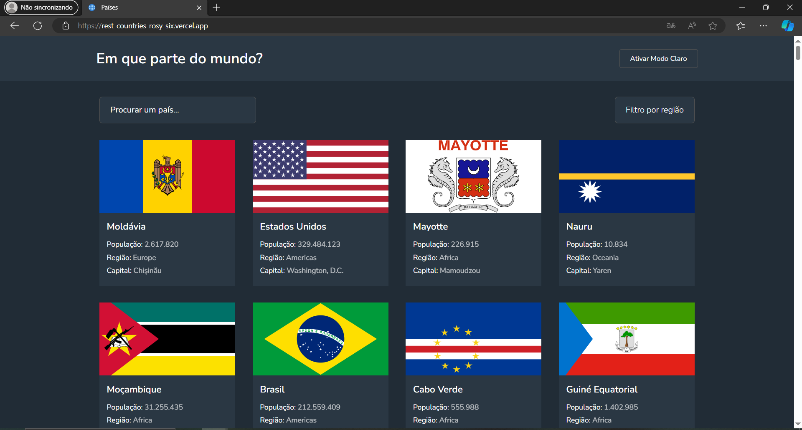

# API REST Países

Esta é uma solução para o desafio [API REST de países com tema de cores no Frontend Mentor](https://www.frontendmentor.io/challenges/rest-countries-api-with-color-theme-switcher-5cacc469fec04111f7b848ca). <br /> Os desafios do Frontend Mentor ajudam-no a melhorar as suas competências de programação através da criação de projectos realistas.

## Índice

- [Visão geral](#visão-geral)
  - [O desafio](#o-desafio)
  - [Captura de tela](#screenshot)
- [Instalação](#instalação)
- [O meu processo](#meu-processo)
  - [Construído com](#construído-com)
  - [O que aprendi](#o-que-aprendi)
  - [Recursos úteis](#recursos-úteis)
- [Autor](#autor)

## [Visão geral](#overview)

O sistema permite aos usuários explorar uma vasta gama de países através de uma página inicial que exibe uma lista completa dos países disponíveis na API. Eles podem navegar intuitivamente ou procurar países específicos usando um campo de pesquisa.

Veja em [https://rest-countries-rosy-six.vercel.app/](https://rest-countries-rosy-six.vercel.app/)

### O desafio

Os usuários devem ser capazes de:

- Ver todos os países da API na página inicial
- Procurar um país utilizando um campo `input`
- Filtrar países por região
- Clicar num país para ver informações mais detalhadas numa página separada
- Alternar o esquema de cores entre o modo claro e escuro

### Captura de tela



### Instalação

- Realizar clone do projeto

```
  git clone https://github.com/Ailson12/rest-countries.git
```

- Instalar as depêndencias

```
  npm install
```

- Iniciar o projeto

```
  npm run dev
```

## Meu processo

- **Ferramentas**: Visual Studio Code e Github.
- **Tecnologias**: JavaScript (Node.js, React).
- **Ciclo**: Planejamento, Implementação, Testes, Revisão.
- **Qualidade**: Testes automatizados

### Construído com

- Marcação HTML5 semântica
- CSS Flexbox, Grid
- [Vite](https://vitejs.dev/) - ambiente de desenvolvimento
- [React](https://reactjs.org/) - Biblioteca JS
- [Vitest](https://vitest.dev/) - Test Runner
- [Zustand](https://docs.pmnd.rs/) - Gerenciar estados globais
- [Styled Components](https://styled-components.com/) - Para estilos
- [React Testing Library](https://testing-library.com/) - Biblioteca de testes

### O que aprendi

**Estados globais em sincronia com o localstorage**

```js
export const useThemeStore = create(
  persist(
    (set) => ({
      theme: ThemeEnum.DARK,
      setTheme(value) {
        set({
          theme: value,
        });
      },
    }),
    {
      // nome da chave aonde o localstorage guardará o valor
      name: "theme-country",
    }
  )
);
```

**Simular dados para api com msw**

```js
import { CountryType } from "@/types/coutry";
import { http, HttpResponse } from "msw";

http.get(`${import.meta.env.VITE_API_URL}/alpha/:ccn3`, (path) => {
    const { ccn3 = "" } = path.params;

    if (ccn3.includes("invalid")) {
      return HttpResponse.json([]);
    }

    return HttpResponse.json<CountryType[]>([
      {
        population: 212559409,
        ccn3: "071",
        translations: {
          por: {
            common: "Brasil",
          },
        },
      },
    ]);
  })
```

**Mais afinidade com a biblioteca @testing-library**

```js
import { CountryCard } from "./index";
import { describe, expect, it } from "vitest";
import { render, screen } from "@testing-library/react";

describe("Coutry Card", () => {
  it("should display the image of the country", async () => {
    render(<CountryCard url={"https://flagcdn.com/br.svg"} />);

    const imageElement = (await screen.findByRole) < HTMLImageElement > "img";

    expect(imageElement).toBeDefined();
    expect(imageElement.src).toEqual("https://flagcdn.com/br.svg");
  });
});
```

### Recursos úteis

- [Mock Service Worker](https://mswjs.io/) Isto ajudou-me porque é possível simular os retornos das apis, o que é muito utíl durante os testes unitários. Eu realmente gostei dessa ferramenta e o usarei daqui para frente.

## Autor

- [Ver Portifólio](https://ailson12.github.io/portifolio/)
- [Ver Linkedin](https://www.linkedin.com/in/ailson-feitosa/)
